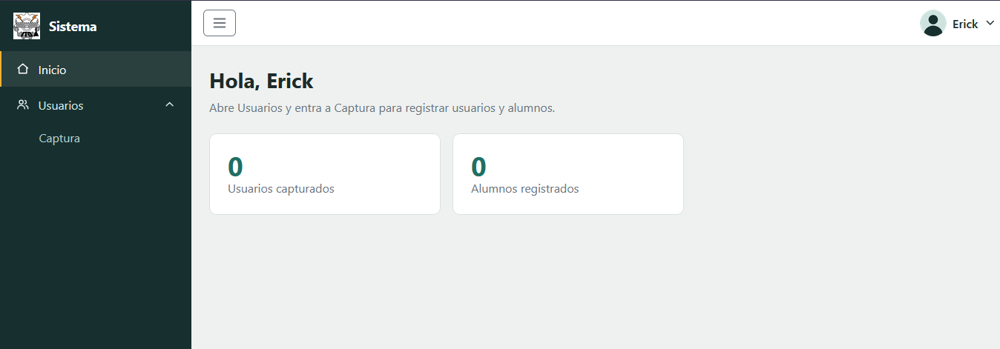
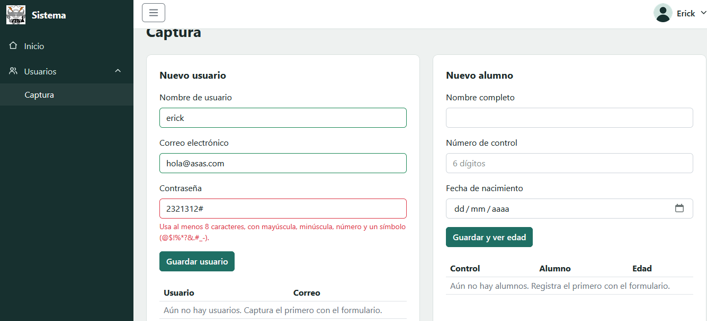
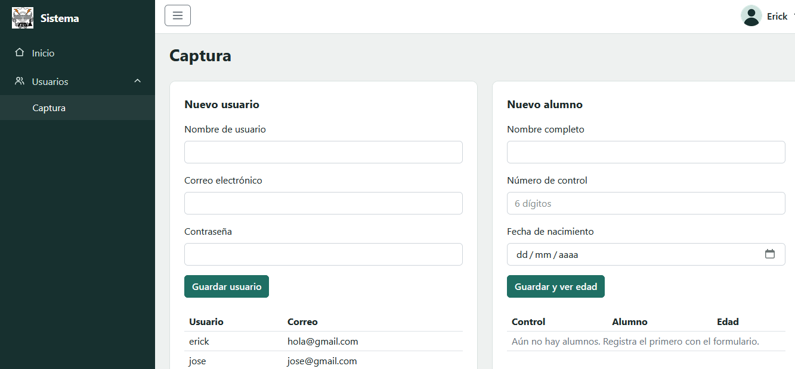
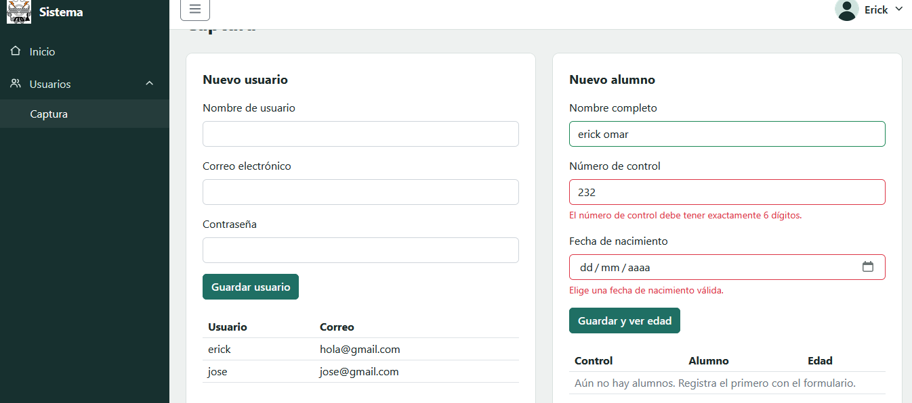
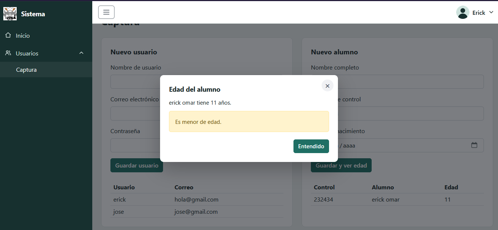

<p align="center">
  
</p>

<h1 align="center">Proyecto Login</h1>
<p align="center"><b>Control de usuarios y alumnos</b></p>

<p align="center">
  Instituto Tecnológico de Oaxaca · Ingeniería en Sistemas Computacionales
</p>

| Integrante | Usuario de GitHub |
|---|---|
| Erick Omar (NOMBRE COMPLETO) | [@ErickOmar4](https://github.com/ErickOmar4) |
| Joseph (NOMBRE COMPLETO) | [@JoseJose7520-dev(https://github.com/JoseJose7520-dev) |

**Demo en vivo (GitHub Pages):**

---

## Descripción

Sistema web de dos pantallas que simula el acceso a un sistema escolar. En `login.html` el usuario escribe su correo y contraseña; si ambos pasan la validación, entra a `index.html`, donde puede capturar usuarios, registrar alumnos con su número de control y consultar en un modal si el alumno es mayor de edad. El inicio de sesión es simulado con JavaScript, sin backend.

**Flujo:** `login.html` → `index.html` → *Salir del sistema* → `login.html`

---

## Tecnologías

- **HTML5, CSS3 y JavaScript** (sin frameworks de JS).
- **Framework CSS:** no se usó Bootstrap ni Tailwind. Los estilos son propios (`css/base.css`, `css/login.css`, `css/index.css`) más la hoja de la librería visual [Componente_Visual](https://github.com/ErickOmar4/Componente_Visual).
- **utileria.js** ([repositorio](https://github.com/ErickOmar4/utileria2.js)): funciones de validación (`validarCorreo`, `validarPassword`, `validarLongitud`, `solo_numeros`, `solo_letras`, `contarCaracteres`, `calcularEdad`, `esMayorEdad`). Se carga por CDN de jsDelivr.
- **librerIaV.js (UIKit):** componentes visuales; se usa para el carrusel del login y el modal de edad.

---

## Estructura del proyecto

```
Proyecto-Login/
├── README.md
├── login.html        Pantalla de acceso
├── index.html        Pantalla del sistema (sidebar, navbar, captura)
├── css/
│   ├── base.css      Variables, botones, campos, alertas y tablas comunes
│   ├── login.css     Estilos del login
│   └── index.css     Estilos del sistema
├── js/
│   ├── login.js      Validación del acceso y creación de la sesión
│   └── index.js      Sidebar, navbar, formularios y modal
└── img/
    ├── avatar.png    Avatar del usuario en el navbar
    ├── logoito.png   Logo e ícono de pestaña
    ├── ito.png       Imagen del carrusel
    └── capturas/     Capturas de pantalla del README
```

---

## Documentación

### ¿Cómo fluye el login hacia el sistema?


### ¿Cómo se pasa el nombre de usuario del login al navbar?

En `login.js`, el nombre se obtiene de la parte del correo antes de la `@`, cambiando puntos o guiones por espacios y poniendo mayúscula a cada palabra. Por ejemplo, `juan.perez@correo.com` se convierte en **Juan Perez**. Se guarda junto con el correo:

```js
sessionStorage.setItem('sesion', JSON.stringify({ correo: mail, nombre }));
```

En `index.js` se lee ese objeto y se coloca en el navbar, en el saludo de Inicio y en el menú desplegable:

```js
const sesion = JSON.parse(sessionStorage.getItem('sesion') || 'null');
$('.usuario-nombre').textContent = sesion.nombre || sesion.correo;
```

### Cerrar sesión

Al dar clic en el nombre del navbar se despliega el menú con **Salir del sistema**. Esa opción borra la sesión con `sessionStorage.removeItem('sesion')` y regresa a `login.html`.

### Métodos principales

| Archivo | Método / evento | Qué hace |
|---|---|---|
| login.js | `marcar(input, ok, mensaje)` | Pinta el campo como válido o inválido y muestra el error |
| login.js | `submit` de `.form-login` | Valida, crea la sesión y redirige a index.html |
| login.js | `click` de `.ver-password` | Muestra u oculta la contraseña |
| index.js | `alternarMenuUsuario(abrir)` | Abre o cierra el dropdown del usuario (también con clic fuera o Esc) |
| index.js | `click` de `.boton-menu` | Abre o cierra el sidebar (botón hamburguesa) |
| index.js | `click` de `[data-vista]` | Cambia entre las vistas Inicio y Captura |
| index.js | `submit` de `.form-usuario` | Valida usuario (3 a 20 caracteres), correo y contraseña |
| index.js | `submit` de `.form-alumno` | Valida nombre, número de control de 6 dígitos y fecha, y abre el modal de edad |
| index.js | `agregarFila()` / `actualizarTotales()` | Agrega el registro a la tabla y actualiza los contadores de Inicio |
| index.js | `escapar(texto)` | Evita inyectar HTML en el contenido del modal |

---

## Proceso de creación

### 1. Login
Se maquetó `login.html` con un panel lateral (logo, carrusel de imágenes y descripción) y el formulario de correo y contraseña. Después se programó `login.js` con las validaciones de `utileria.js` y la sesión simulada.


### 2. Sidebar


### 3. Navbar con el usuario
En la parte derecha se muestra el avatar y el nombre del usuario que inició sesión. Al hacer clic se despliega su correo y la opción **Salir del sistema**.


### 4. Captura de usuarios



Se accede desde el sidebar: **Usuarios → Captura**. El formulario "Nuevo usuario" pide tres datos y valida cada uno con `utileria.js`: el cual usamos mediante el link del cdn


| Campo | Regla | Función usada |
|---|---|---|
| Nombre de usuario | Entre 3 y 20 caracteres | `contarCaracteres` |
| Correo electrónico | Formato `nombre@dominio.com` | `validarCorreo` |
| Contraseña | Mínimo 8 caracteres, con mayúscula, minúscula, número y un símbolo (`@$!%*?&.#_-`) | `validarPassword` |

- Cada campo se marca en verde si es válido o en rojo con su mensaje de error debajo.



- Si los tres datos son válidos, el usuario se agrega a la tabla "Usuarios", el contador de la pantalla de Inicio aumenta y el formulario se limpia.
- Los datos viven solo en memoria: al recargar la página se pierden (no hay backend).


### 5. Número de control

Está en el formulario "Nuevo alumno", junto al nombre y la fecha de nacimiento.


- Debe tener **exactamente 6 dígitos**: se valida con `solo_numeros` y `validarLongitud(valor, 6)`.
- El campo solo acepta números: cualquier otro carácter que se escriba o pegue se elimina, y tiene `maxlength="6"`.
- Si el número no cumple, aparece el mensaje "El número de control debe tener exactamente 6 dígitos".
- Tampoco se permite registrar dos alumnos con el mismo número de control.

### 6. Modal de edad

Al guardar un alumno con todos los datos válidos se abre un modal creado con la librería visual (`UIKit.modal`).

- La edad se calcula con `calcularEdad` a partir de la fecha de nacimiento, y `esMayorEdad` decide si es mayor de 18 años.
- El modal muestra el nombre del alumno, su edad y un aviso:
  - verde: **"Es mayor de edad"**
  - amarillo: **"Es menor de edad"**
- Se cierra con el botón "Entendido", con la ×, haciendo clic fuera del modal o con la tecla `Esc`.
- El nombre se escapa antes de mostrarse, para que no se pueda inyectar HTML.

---

## Flujo completo funcionando

1. Abre `login.html`. A la izquierda se ve el carrusel de imágenes y a la derecha el formulario.
2. Escribe un correo y una contraseña inválidos (por ejemplo `ana@` y `abc`): aparecen los errores en rojo y no se avanza.
3. Escribe datos válidos, por ejemplo `ana.lopez@correo.com` y `Clave123!`, y pulsa **Entrar**. Se redirige a `index.html`.
4. En el navbar aparece el nombre **Ana Lopez** a la derecha. Al hacer clic se despliega el menú con el correo y la opción **Salir del sistema**.
5. Usa el botón hamburguesa para cerrar y abrir el sidebar.
6. Abre **Usuarios → Captura** y registra un usuario con datos válidos. Aparece en la tabla y el contador de Inicio sube.
7. En el formulario de alumnos prueba un número de control incorrecto (`12345`): se muestra el error. Luego usa uno válido (`123456`), escribe un nombre y elige una fecha de nacimiento.
8. Al guardar se abre el modal de edad:
   - con una fecha como `2000-01-01` indica **mayor de edad**;
   - con una fecha como `2010-01-01` indica **menor de edad**.
9. Pulsa **Salir del sistema**: se cierra la sesión y regresa a `login.html`. Si intentas abrir `index.html` directamente, te manda de nuevo al login.


## Cómo ejecutarlo

- **En línea:** abrir el enlace de GitHub Pages de arriba.
- **Local:** clonar el repositorio y abrir `login.html` en el navegador (o con la extensión Live Server de VS Code).

```
git clone https://github.com/ErickOmar4/Proyecto-Login.git
```
